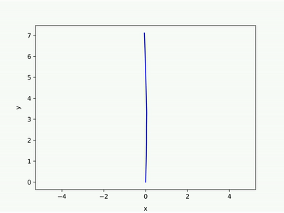
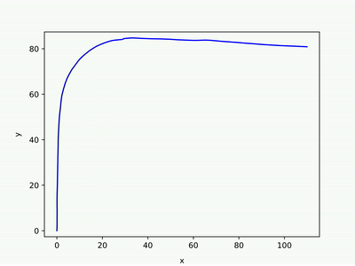
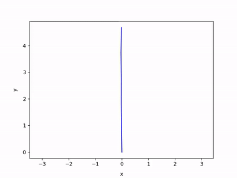
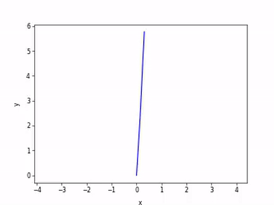
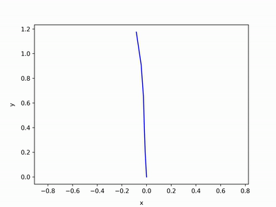
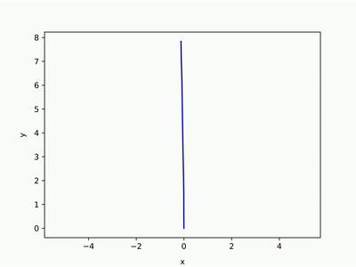
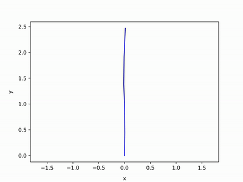
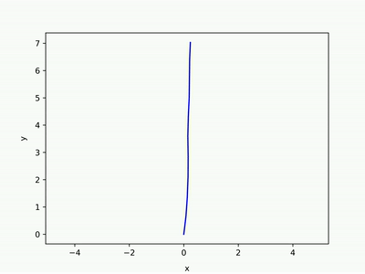

# PyICP SLAM
Full-python LiDAR SLAM.

(if you find a C++ version of this repo, go to https://github.com/irapkaist/SC-LeGO-LOAM)

### Purpose
- Full-python LiDAR SLAM
    - Easy to exchange or connect with any Python-based components (e.g., DL front-ends such as [Deep Odometry](https://www.youtube.com/watch?v=Y2s08dv-Mq0))
        - Here, ICP, which is a very basic option for LiDAR, and [Scan Context (IROS 18)](https://github.com/irapkaist/scancontext) are used for odometry and loop detection, respectively.
- Hands-on LiDAR SLAM
    - Easy to understand (could be used for educational purpose)
- The practical use case of [miniSAM](https://github.com/dongjing3309/minisam)
    - The miniSAM is easy to use at Python

### What is SLAM?
- In this repository, SLAM (Simultaneous localization and mapping) is considered as
    - SLAM = Odometry + Loop closure
- In this repository, the state to be optimized only has robot poses; that is _pose-graph SLAM_.

### Overview of the PyICP SLAM
- The pipeline of the PyICP SLAM is composed of three parts
    1. Odometry: [ICP (iterative closest point)](https://github.com/ClayFlannigan/icp/blob/master/icp.py)
        - In here, Point-to-point and frame-to-frame (i.e., no local mapping)
    2. Loop detection: [Scan Context (IROS 18)](https://github.com/irapkaist/scancontext)
       -  Reverse loop detection is supported.
    3. Back-end (graph optimizer): [miniSAM](https://github.com/dongjing3309/minisam)
       - Python API


### Features
- Thanks to the Scan Context, reverse loops can be successfully closed.
    - E.g., see _KITTI 14_ at Results section below.

- Time costs
    - (Here, no accelerated and naive) ICP gets 7-10 Hz for randomly downsampled points (7000 points)
    - (Here, no accelerated and naive) Scan Context gets 1-2 Hz (when 10 ringkey candidates).
        - if you need the more faster one, consider the C++ version of Scan Context (e.g., https://github.com/irapkaist/SC-LeGO-LOAM)
    - miniSAM is enough fast.


### How to use
Just run

```sh
$ python3 main_icp_slam.py
```

The details of parameters are eaily found in the argparser in that .py file.


### Results (KITTI dataset)
Those results are produced under the same parameter conditions:
- ICP used random downsampling, 7000 points.
- Scan Context's parameters:
    - Ring: 20, Sector: 60
    - The number of ringkey candidates: 30
    - Correct Loop threshold: 0.17 for 09, 0.15 for 14, and 0.11 for all others

Results (left to right):

- 00 (loop), 01, 02 (loop), 03

   

- 04, 05 (loop), 06 (loop), 09 (loop)

   

- 10, 11, 12, 13 (loop)

   

- 14 (loop), 15 (loop), 16 (loop), 17

   

- 18 (loop), 20

 

Some of the results are good, and some of them are not enough.
Those results are for the study to understand when is the algorithm works or not.


### Findings
- The Scan Context does not find loops well when there is a lane level change (i.e., KITTI 08, as below figures).
- If the loop threshold is too low (0.07 in the below figure), no loops are detected and thus the odometry errors cannot be reduced.

  - 

- If the loop threshold is high (0.20 in the below figure), false loops are detected and thus the graph optimization failed.
    - 
    - but using this non-conservative threshold with a robust kernel would be a solution.
        - see https://github.com/irapkaist/SC-LeGO-LOAM/blob/3170ba1de7bb0d3f8de5192742e0bbe267415ab4/SC-LeGO-LOAM/LeGO-LOAM/src/mapOptmization.cpp#L994


### Author
```sh
  Giseop Kim (paulgkim@kaist.ac.kr)
```

### Contirbutors
```sh
  @JustWon
    - Supports Pangolin-based point cloud visualization along the SLAM poses.
    - Go to https://github.com/JustWon/PyICP-SLAM
```
